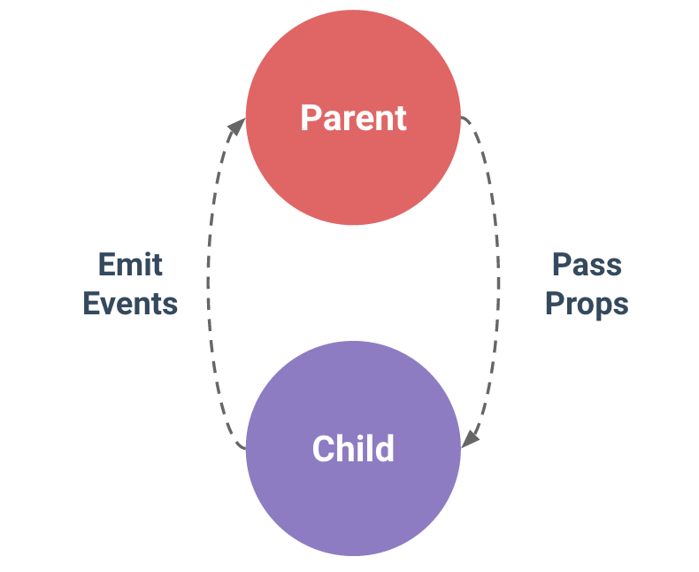

# 基于vue单页面的组件开发

## 什么是组件？
组件 (Component) 是 Vue.js 最强大的功能之一。组件可以扩展 HTML 元素，封装可重用的代码。所有的 Vue 组件同时也都是 Vue 的实例，所以可接受相同的选项对象 (除了一些根级特有的选项) 并提供相同的生命周期钩子。

## 怎么使用组件？
- **注册组件**
    ``` js
    import { Modal } from 'long-ui'
    export default {
        components: {
            Modal
        }
    }
    ```
- **使用自定义标签**
    ``` html
    <modal title="Login Modal" ref="loginModal">
      <div class="login-modal">
        <text-field label="用户名" placeholder="请输入用户名"></text-field>
        <text-field label="密码" placeholder="请输入密码" type="password"></text-field>
        <item-form>
          <ui-switch label="自动登录"></ui-switch>
        </item-form>
      </div>
      <Button text="取消" slot="footer" @click.native="hideModal('loginModal')" fill></Button>
      <Button text="登录" slot="footer" @click.native="hideModal('loginModal')" color="red" fill></Button>
    </modal>
    ```

## 父子通信


``` html
<template>
<div>
  <transition name="ui-modal-scale">
    <div class="ui-modal" v-show="isShow" :style="{'z-index': zIndex}">
      <div class="ui-modal-header" v-if="title">
        <div class="ui-modal-title">
            {{title}}
        </div>
      </div>
      <div class="ui-modal-body">
        <slot>
          <div v-if="msg">
            {{msg}}
          </div>
        </slot>
      </div>
      <div class="ui-modal-footer" v-if="!hideClose">
        <slot name="footer">
          <Button text="关闭" @click.native="hideModel"></Button>
        </slot>
      </div>
    </div>
  </transition>
  <transition name="ui-modal-scale">
    <div class="ui-modal-overlay" v-if="isShow" @click="hideModel" @touchmove="prevent" :style="{'z-index': overlayZIndex}"></div>
  </transition>
</div>
</template>

<script>
import {getZIndex} from 'utils/index'
export default {
  props: {
    title: {
      type: String,
      default: ''
    },
    msg: {
      type: String,
      default: ''
    },
    hideClose: {
      type: Boolean,
      default: false
    }
  },
  data () {
    return {
      isShow: false,
      overlayZIndex: getZIndex(),
      zIndex: getZIndex()
    }
  },
  watch: {
    isShow () {
      this.$nextTick(() => {
        this[this.isShow ? 'onOpen' : 'onClose']()
      })
    }
  },
  methods: {
    open () {
      this.isShow = true
    },
    close () {
      this.isShow = false
    },
    onOpen () {
      this.$emit('open')
    },
    onClose () {
      this.$emit('close')
    },
    hideModel () {
      this.isShow = false
    },
    prevent (event) {
      event.preventDefault()
      event.stopPropagation()
    }
  }
}
</script>
<style lang="less" scoped>

</style>
```
- **props**
    外部传递组件数据
- **$emit**
    组件向外发送事件
- **slot**
    外部逻辑整合到组件中(插槽)
- **ref**
    用来给元素或子组件注册引用信息


## 生命周期
  每个 Vue 实例包含Component在被创建时都要经过一系列的初始化过程。例如，需要设置数据监听、编译模板、将实例挂载到DOM并在数据变化时更新DOM等。同时在这个过程中也会运行一些生命周期钩子的函数，我们可以在不同阶段添加自己的代码。
  
  在组建中使用生性周期钩子函数时，如果组件使用了`keep-alive`指令，部分钩子函数在组建激活后就不会执行，同时会增加组件激活时`activated()`和组件停用后`deactivated()`这两个函数。

  | hooks | desc |
  | ----- | ----- |
  | beforeCreate | 组件实例刚被创建,组件属性计算之前,如`$data/$el`属性不存在 |
  | create | 组件实例创建完成,属性已绑定,但DOM还未生成,`$data`属性存在，`$el`属性还不存在 |
  | beforeMount | 模板编译挂载之前，`$el`为虚拟，`render` 函数首次被调用 |
  | mounted | 模板编译挂载之后，`el` 被新创建的 `vm.$el` 替换，`$el`为真实(不保证组件已在`document`中，`$nextTick`方法可以保证) |
  | beforeUpdate | 数据更新之前 |
  | updated | 数据更新之后 |
  | activated | keep-alive,组件被激活时调用 |
  | deactivated | keep-alive,组件被停用时调用 |
  | beforeDestory | 组件销毁前调用，实例仍然完全可用 |
  | destoryed | 组件销毁后调用，Vue实例指示的所有东西都会解绑 |

## 怎么设计组件
- **单一职责**
    如Alert/Toast/Loading/Confirm等组件, 通过名字就能知道他们都是用于提示用户操作结果的, 为了保证单一职责原则,当代码有重复可合并的情况下进行抽离，类似这样的公共特性需要封装为独立的组件。
- **接口隔离**
    Vue组件对外有三个API：
      - **`Props`**
      - **`Event`**
      - **`Slot`**
      如果在使用组件时, 在向组件内传递数据, 或者监听组件的状态使用`Props`和`Events`就可以, 不建议通过this找`$parent/$children`等方法获取组件的直接操作，仅在特殊情况使用。

## 为样式添加作用域空间
  给样式加上作用域空间可以避免组件样式影响外部的样式, `scoped` 属性会自动添加一个唯一的属性 (比如`data-v-73d2f924`) 为组件内 CSS 指定作用域，编译的时候 `.ui-modal` 会被编译成类似 `.ui-modal[data-v-73d2f924]`。
  ``` css
  <style lang="less" scoped>
    .ui-modal {
      position: fixed;
    }
  </style>
  ```

## 组件及其事件的命名
  精简、可读，团队开发时制订命名规范

## 单元测试

## npm发布与添加开原协议LICENSE
